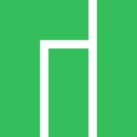

<h1> <a href="https://www.linkedin.com/in/lana-qe-mba/">Software Test Engineer</a> </h1>

<h2>👨‍💻 Quality Engineering Projects:</h2>

- <b>Cypress Automation Portfolio Project </b>
  - [Banking App](https://github.com/joshmadakor1/Algorithms-Practice)
- <b>Python Automation Portfolio Project</b>
  - [Tesla App](https://github.com/joshmadakor1/4chan-Image-Analysis-Middleware-C964)</i>
- <b>Test Plans</b>
  - [Windows EventLog: Failed RDP Logins Source IP to full GeoData Conversion](https://github.com/joshmadakor1/Sentinel-Lab)
- <b>Test Cases</b>
  - [Windows EventLog: Failed RDP Logins Source IP to full GeoData Conversion](https://github.com/joshmadakor1/Sentinel-Lab)
- <b>Checklists</b>
  - [Windows EventLog: Failed RDP Logins Source IP to full GeoData Conversion](https://github.com/joshmadakor1/Sentinel-Lab)

 ### Technologies I Use

---

### Technical Skills and Favorite Tech

<table>
  <tr>
    <td align="center" Align Middle width="96">
        Operating systems
    </td>
    <td align="center" width="96">
      
       Linux
    </td>
    <td align="center" width="96">
      
       MacOS
    </td>
    <td align="center" width="96">
      
       Android
    </td>
    <td align="center" width="96">
      
       Windows
    </td>
    <td align="center" width="96">
      
       Manjaro
    </td>
    <td align="center" width="96">
      
       Ubuntu
    </td>
    <td align="center" width="96">
      
       Debian
    </td>
  </tr>
  <tr>
    <td align="center" valign="center" width="100"> 
       Programming languages
    </td>
    <td align="center" width="96">
      
       Python
    </td>
    <td align="center"  width="96">
      
       JavaScript
    </td>
    <td align="center"  width="96">
      
       Perl
    </td>
    <td align="center" width="96">
      
       NodeJS
    </td>
    <td align="center"  width="96">
      
       Bash
    </td>
    <td align="center" width="96">
      
       Rust
    </td>
    <td align="center" width="96">
      
       Java
    </td>
  </tr>
    <tr>
    <td align="center" Align Middle width="96">
       Markdown & Query languages
    </td>
     <td align="center"  width="96">
      
       HTML
    </td>
     <td align="center"  width="96">
      
       CSS
    </td>
     <td align="center"  width="96">
      
       JSON
    </td>
     <td align="center"  width="96">
      
       XML
    </td>
    <td align="center"  width="106">
      
       XPATH
    </td>
     <td align="center"  width="96">
      
       SQL
    </td>
     <td align="center"  width="96">
      
       GraphQL
    </td>
      
  <tr>
    <td align="center" Align Middle width="96">
       SQL  &  NoSQL Databases
    </td>
    <td align="center"  width="96">
      
       PostgreSQL
    </td>
     <td align="center"  width="96">
        
         PyCharm
     </td>
      <td align="center"  width="96">
        
         SQLite
     </td>
      <td align="center"  width="96">
        
         BerkleyDB
     </td>
      <td align="center"  width="96">
        
         MongoDB
     </td>
      <td align="center"  width="96">
        
         Redis
     </td>
      <td align="center"  width="96">
        
         Memcached
     </td>
  </tr>
  <tr>
    <td align="center" Align Middle width="96">
       IDE  &  Text Editors
    </td>
    <td align="center"  width="96">
       
        Vim
    </td>
    <td align="center"  width="96">
       
        PyCharm
    </td>
        <td align="center"  width="96">
       
        WebStorm
    </td>
    <td align="center"  width="96">
       
        VSCode
    </td>
        <td align="center"  width="96">
       
        Atom
    </td>
        <td align="center"  width="96">
       
        Sublime
    </td>
    </td>
        <td align="center"  width="96">
       
        Komodo
    </td>
  </tr>
</table>
  
<!--
**CommittedtoQuality/CommittedtoQuality** is a ✨ _special_ ✨ repository because its `README.md` (this file) appears on your GitHub profile.
  
 
Here are some ideas to get you started:

- 🔭 I’m currently working on ...
- 🌱 I’m currently learning ...
- 👯 I’m looking to collaborate on ...
- 🤔 I’m looking for help with ...
- 💬 Ask me about ...
- 📫 How to reach me: ...
- 😄 Pronouns: ...
- ⚡ Fun fact: ...
-->
