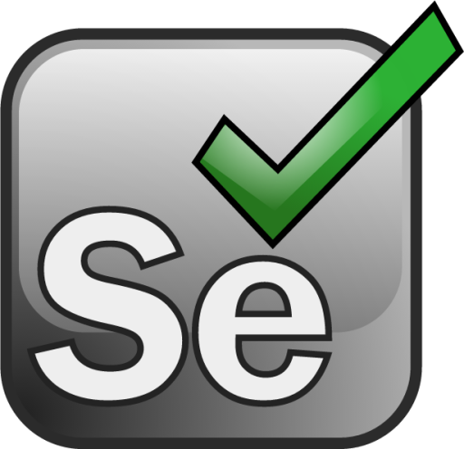

<div align="center">


<details>
<summary>Open profile</summary>

[comment]: <> (View Counter)
<br>
<div>
  <div align=center>
      
<p align="center">

 <p/>
  </div>
  <div align=center>
      <a href="https://git.io/typing-svg"></a>    
  </div>
</div>

<details>
<summary>About me</summary>

[//]: # (You must have a lf before the markdown element when inside a block for it to work: https://stackoverflow.com/questions/29368902/how-can-i-wrap-my-markdown-in-an-html-div)

<div align="left">

```js
/**
 * Represents me.
 * @constructor
 * @param {string} city - Los Angeles, CA.
 * @param {string} languagues - English, Ukrainian, Russian, Spanish.
 * @param {string} jobTitle - Full Stack Software Development Engineer in Test.
 * @param {string} specialization - Manual and automated testing.
 * @param {string} interests - Web3, crypto & AI.
 * @param {string} hobbies - Reading, hiking & cooking.
 * @param {string} education - MBA, University of La Verne.
 * @throws {Punch} To any and all bugs.
 */
```

</div>

</details>

<details>
<summary>Tools</summary>
<div>
   <a align="center" href="https://git.io/typing-svg"></a> 
  <p style="display: inline-block;" align="center">
    <kbd>
      <kbd>Programming Languages</kbd>
      <br>
      <br>
       
       
    </kbd>
    <kbd>
      <kbd>Markdown & Query languages</kbd>
      <br>
      <br>
       
       
      
      
      
       
    </kbd>
     <kbd>
      <kbd>Mobile</kbd>
      <br>
      <br>
      
       &nbsp;
    </kbd>
    <kbd>
      <kbd>Database</kbd>
      <br>
      <br>
      
      
      
      
    </kbd>
    <br>
    <br>
    <kbd>
      <kbd>Test Automation</kbd>
      <br>
      <br>
      
      &nbsp;
      
       
         
       &nbsp;
    </kbd>
    <kbd>
      <kbd>Test Management</kbd>
      <br>
      <br>
        
        
    </kbd>
    <kbd>
      <kbd>Terminal Scripts</kbd>
      <br>
      <br>
      
      
    </kbd>
    <kbd>
      <kbd>IDE & Text Editors</kbd>
      <br>
      <br>
      
      
      
      
  </kbd>
     <kbd>
      <kbd>Operating Systems</kbd>
      <br>
      <br>
      
      
      
    </kbd>
  </p>
</div>
</details>

<details>
  <summary>Quotes</summary>
  <br>
  <blockquote>
     <em>"Never allow the same bug to bite you twice."</em><br><strong>~Steve Maguire </strong>
     <br><em>“Quality is not an act. It is a habit.”</em> <br><strong>~Aristotle</strong>
     <br><em>“Give them quality. That’s the best kind of advertising.”</em> <br><strong>~Milton Hersey</strong>
  </blockquote>
</details>

<details>
<summary>Portfolio Projects:</summary>
<table style="border: thick double #32a1ce">
  <tr>
  <td width="50%" valign="top">

[//]: # (Fighting against markdown and blocks isn't easy, indentation is catastrophic)

## <b> Automation (Cypress/JS) </b>

  - [Cypress Test Framework](https://github.com/CommittedtoQuality/Automation-Selenium-Python-Project/tree/main)</i>

  </td>
  <td width="50%" valign="top">

## <b> Automation (Selenium/Python)</b>
  - [Selenium (Python) Test Framework](https://github.com/CommittedtoQuality/Automation_Selenium)</i> 

  </td>
  </tr>
</table>


<table>
  <tr>
    <td align="center" Align Middle width="96">
       <br><b>Portfolio Project #1</b>
    </td>
     <td align="center"  width="96">
      <a href="https://www.javascript.com/">
        
      </a>
      <br>JavaScript
    </td>
    <td align="center" width="96">
      <a href="#https://www.apple.com/macos">
        
      </a>
      <br>Cypress
    </td>
    <td align="center" width="780">
      <a href="https://www.android.com/">
        
      </a>
      <br>Link
    </td>
  </tr>
  <tr>
    <td align="center" valign="center" width="100"> 
      <br<b>Portfolio Project #2</b>
    </td>
    <td align="center" width="96">
      <a href="https://www.python.org/" >
        
      </a>
      <br>Python
    </td>
    <td align="center"  width="96">
      <a href="https://www.javascript.com/">
        
      </a>
      <br>Selenium
    </td>
    <td align="center"  width="96">
      <a href="https://www.perl.org/">
        
      </a>
      <br>Perl
    </td>
    <td align="center" width="96">
      <a href="https://www.gnu.org/software/bash/manual/">
        
      </a>
      <br>NodeJS
    </td>
    <td align="center"  width="96">
      <a href="https://www.gnu.org/software/bash/manual">
        
      </a>
      <br>Bash
    </td>
    <td align="center" width="96">
      <a href="https://www.rust-lang.org/" >
        
      </a>
      <br>Rust
    </td>
    <td align="center" width="96">
      <a href="https://www.java.com/" >
        
      </a>
      <br>Java
    </td>
  </tr>
</table>


</details>

</details>


</div>

<div align=center>
  <a href="https://www.linkedin.com/in/lana-qe-mba/"></a>
</div>


  
</a>

<h2>  Quality Engineering Projects:</h2>

- <b> Test Automation with Cypress Portfolio Project </b>
  - [Cypress Test Framework](https://github.com/CommittedtoQuality/Automation-Selenium-Python-Project/tree/main)</i>
- <b> Test Automation with Selenium + Python Portfolio Project</b>
  - [Selenium (Python) Test Framework](https://github.com/CommittedtoQuality/Automation-Selenium-Python-Project/tree/main)</i> 
---

 <a align="center" href="https://git.io/typing-svg"></a> 
</div>


<table>
  <tr>
    <td align="center" Align Middle width="96">
       <br>Operating systems
    </td>
    <td align="center" width="96">
      <a href="https://www.linux.org/">
        
      </a>
      <br>Linux
    </td>
    <td align="center" width="96">
      <a href="#https://www.apple.com/macos">
        
      </a>
      <br>MacOS
    </td>
    <td align="center" width="96">
      <a href="https://www.android.com/">
        
      </a>
      <br>Android
    </td>
    <td align="center" width="96">
      <a href="https://www.microsoft.com/en-us/windows/">
        
      </a>
      <br>Windows
    </td>
    <td align="center" width="96">
      <a href="https://manjaro.org/">
        
      </a>
      <br>Manjaro
    </td>
    <td align="center" width="96">
      <a href="https://ubuntu.com/">
        
      </a>
      <br>Ubuntu
    </td>
    <td align="center" width="96">
      <a href="https://www.debian.org/">
        
      </a>
      <br>Debian
    </td>
  </tr>
  <tr>
    <td align="center" valign="center" width="100"> 
      <br>Programming languages
    </td>
    <td align="center" width="96">
      <a href="https://www.python.org/" >
        
      </a>
      <br>Python
    </td>
    <td align="center"  width="96">
      <a href="https://www.javascript.com/">
        
      </a>
      <br>JavaScript
    </td>
    <td align="center"  width="96">
      <a href="https://www.perl.org/">
        
      </a>
      <br>Perl
    </td>
    <td align="center" width="96">
      <a href="https://www.gnu.org/software/bash/manual/">
        
      </a>
      <br>NodeJS
    </td>
    <td align="center"  width="96">
      <a href="https://www.gnu.org/software/bash/manual">
        
      </a>
      <br>Bash
    </td>
    <td align="center" width="96">
      <a href="https://www.rust-lang.org/" >
        
      </a>
      <br>Rust
    </td>
    <td align="center" width="96">
      <a href="https://www.java.com/" >
        
      </a>
      <br>Java
    </td>
  </tr>
    <tr>
    <td align="center" Align Middle width="96">
      <br>Markdown & Query languages
    </td>
     <td align="center"  width="96">
      <a href="https://www.postgresql.org/">
        
      </a>
      <br>HTML
    </td>
     <td align="center"  width="96">
      <a href="https://www.postgresql.org/">
        
      </a>
      <br>CSS
    </td>
     <td align="center"  width="96">
      <a href="https://www.postgresql.org/">
        
      </a>
      <br>JSON
    </td>
     <td align="center"  width="96">
      <a href="https://www.postgresql.org/">
        
      </a>
      <br>XML
    </td>
    <td align="center"  width="106">
      <a href="https://www.postgresql.org/">
        
      </a>
      <br>XPATH
    </td>
     <td align="center"  width="96">
      <a href="https://www.postgresql.org/">
        
      </a>
      <br>SQL
    </td>
     <td align="center"  width="96">
      <a href="https://www.postgresql.org/">
        
      </a>
      <br>GraphQL
    </td>
      
  <tr>
    <td align="center" Align Middle width="96">
      <br>SQL  &  NoSQL Databases
    </td>
    <td align="center"  width="96">
      <a href="https://www.postgresql.org/">
        
      </a>
      <br>PostgreSQL
    </td>
     <td align="center"  width="96">
        <a href="https://www.mysql.com/">
          
        </a>
        <br>PyCharm
     </td>
      <td align="center"  width="96">
        <a href="https://www.mysql.com/">
          
        </a>
        <br>SQLite
     </td>
      <td align="center"  width="96">
        <a href="https://www.oracle.com/database/technologies/related/berkeleydb.html">
          
        </a>
        <br>BerkleyDB
     </td>
      <td align="center"  width="96">
        <a href="https://www.mongodb.com/">
          
        </a>
        <br>MongoDB
     </td>
      <td align="center"  width="96">
        <a href="https://redis.com/">
          
        </a>
        <br>Redis
     </td>
      <td align="center"  width="96">
        <a href="https://memcached.org/">
          
        </a>
        <br>Memcached
     </td>
  </tr>
  <tr>
    <td align="center" Align Middle width="96">
      <br>IDE  &  Text Editors
    </td>
    <td align="center"  width="96">
       <a href="https://www.vim.org/">
          
       </a>
       <br>Vim
    </td>
    <td align="center"  width="96">
       <a href="https://www.jetbrains.com/pycharm/">
          
       </a>
       <br>PyCharm
    </td>
        <td align="center"  width="96">
       <a href="https://www.jetbrains.com/pycharm/">
          
       </a>
       <br>WebStorm
    </td>
    <td align="center"  width="96">
       <a href="https://code.visualstudio.com/">
          
       </a>
       <br>VSCode
    </td>
        <td align="center"  width="96">
       <a href="https://github.com/atom">
          
       </a>
       <br>Atom
    </td>
        <td align="center"  width="96">
       <a href="https://www.sublimetext.com/">
          
       </a>
       <br>Sublime
    </td>
    </td>
        <td align="center"  width="96">
       <a href="https://www.activestate.com/products/komodo-ide/">
          
       </a>
       <br>Komodo
    </td>
  </tr>
</table>

  

<!--
**CommittedtoQuality/CommittedtoQuality** is a ✨ _special_ ✨ repository because its `README.md` (this file) appears on your GitHub profile.
  
 
Here are some ideas to get you started:

- 🔭 I’m currently working on ...
- 🌱 I’m currently learning ...
- 👯 I’m looking to collaborate on ...
- 🤔 I’m looking for help with ...
- 💬 Ask me about ...
- 📫 How to reach me: ...
- 😄 Pronouns: ...
- ⚡ Fun fact: ...
-->
